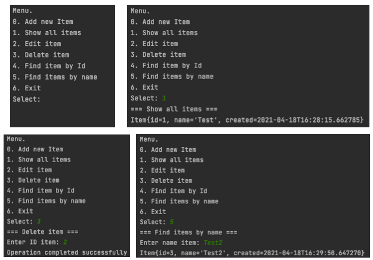

# job4j_tracker

## Используемые технологии

Проект Tracker - консольное приложение для работы с заявками. Пользователю отображается меню с возможностями программы. Программа может:

0. Добавлять заявку.
1. Отображать список всех заявок.
2. Редактировать заявку.
3. Удалять заявку по ID.
4. Производить поиск по ID заявки.
5. Производить поиск по имени заявки.

## Содержимое проекта
- Главное меню: <a href="https://github.com/kamikhaylov/job4j_tracker/blob/master/src/main/java/ru/job4j/memTracker/StartUI.java">ru.job4j.memTracker.StartUI.java</a>
- Модель данных: <a href="https://github.com/kamikhaylov/job4j_tracker/blob/master/src/main/java/ru/job4j/memTracker/Item.java">ru.job4j.memTracker.Item.java</a>

## Ключевые этапы разработки
- Проектирование модели данных
- Проектирование меню
- Проектирование действий меню
- Разрыв зависимости StartUI от Scanner
- Реализация меню используя шаблон проектирования Стратегия
- Реализация тестов класса StartUi
- Использование шаблона проектирования Декоратор для валидатора
- Подключение проекта к Jacoco
- Интеграция с Travis CI

#### Проект содержит решения блоков из базового курса 
<a href="https://github.com/kamikhaylov/job4j_elementary">Job4j по основам языка Java</a>
- ООП
- Collections Lite
- FP, Lambda
- Stream API